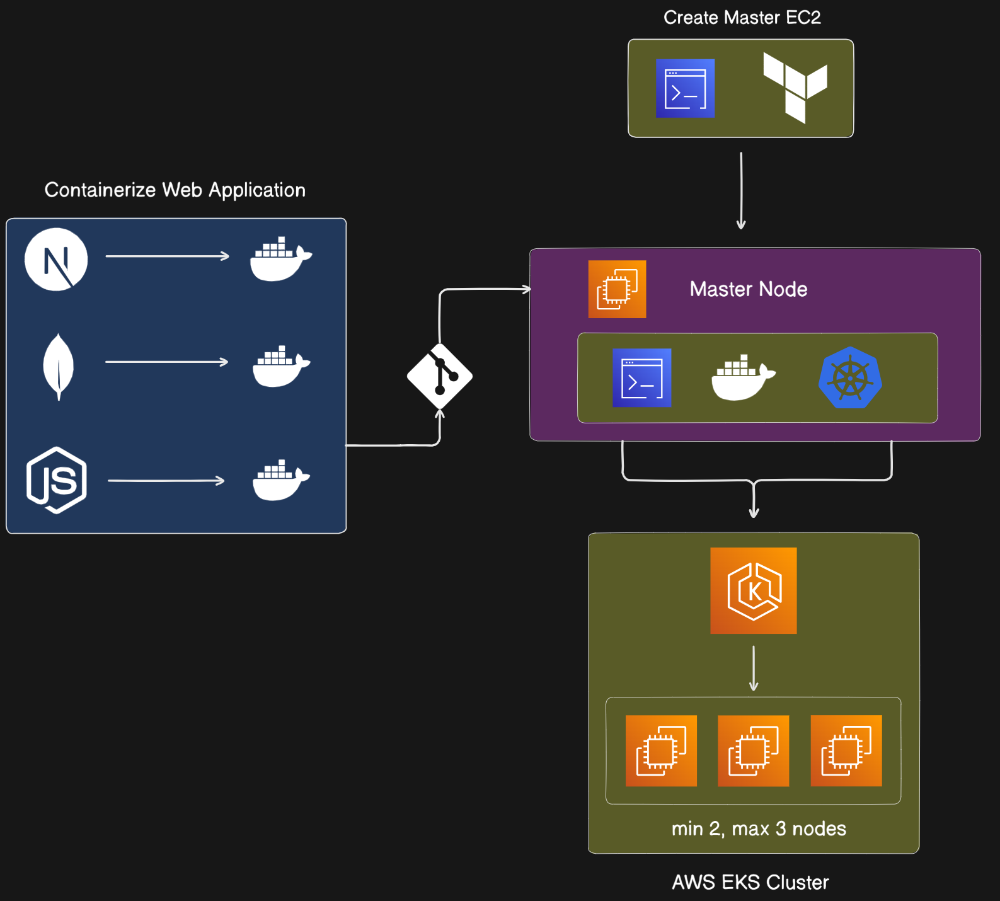
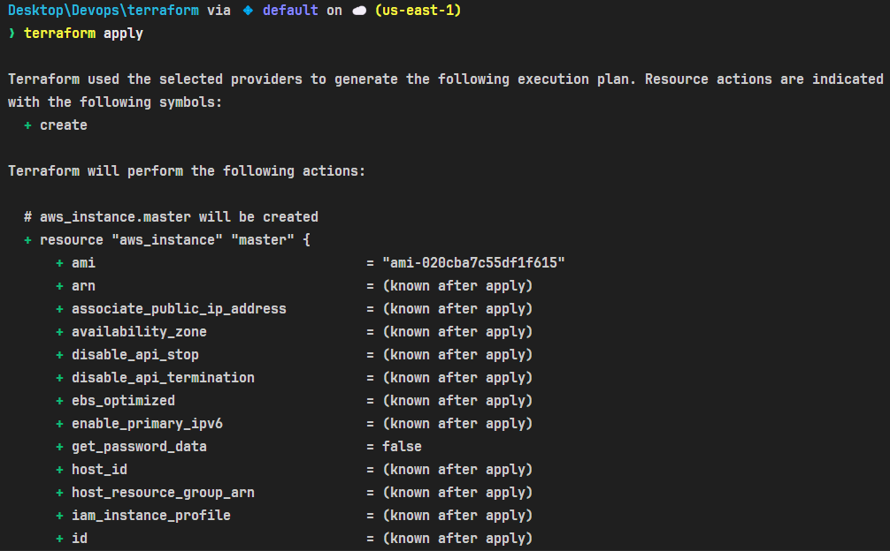
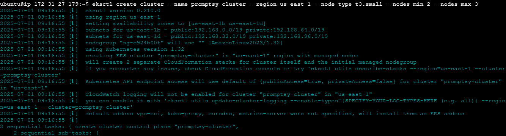
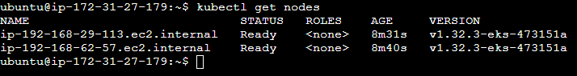
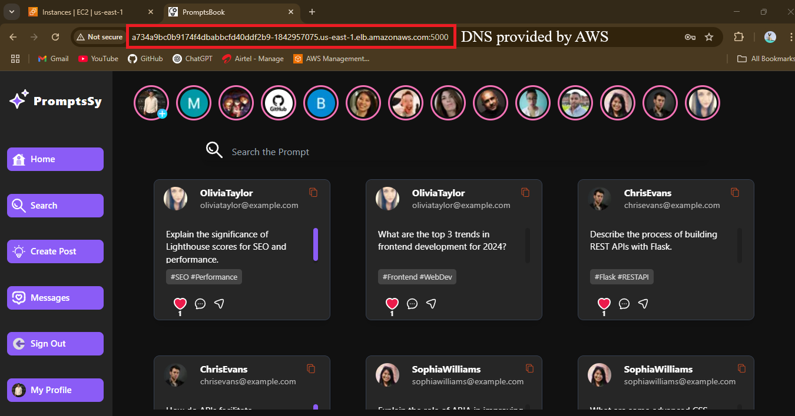

<div align="center">

# PromptsBook Deployed on AWS EKS (auto scale)

---


### Technologies Used


<br>
</div>

## 📦 Tech Stack

- **Frontend**: Next.js + Tailwind CSS
- **Backend**: Node.js + Express.js
- **Database**: MongoDB
- **Containerization**: Docker, Docker Hub
- **Orchestration**: Kubernetes on AWS EKS
- **Provisioning**: Terraform
- **Tools**: AWS CLI, kubectl

---

## 🗺️ Architecture Overview



---

## 🛠️ Setup and Deployment Steps

### ✅ Step 1: Install AWS-CLI and Terraform on local machine

### ✅ Step 2: Configure AWS and create Master EC2 instance through Terraform

```
aws configure
terraform init
terraform apply
```



### ✅ Step 3: Install kubectl, eksctl, docker.io on Master instance

### ✅ Step 4: Create EKS clusters through following command

```
eksctl create cluster --name promptsy --region us-east-1 --node-type t2.medium --nodes-min 2 --nodes-max 2 aws eks update-kubeconfig --region us-east-1 --name promptsy kubectl get nodes 
```






### ✅ Step 5: Apply Manifests files

###### 1. For mongodb deployment and service

1. [mongo-pv.yml](./Kubernetes/mongo-pv.yml)
2. [mongo-pvc.yml](./Kubernetes/mongo-pvc.yml)
3. [mongo-dep.yml](./Kubernetes/mongo-dep.yml)
4. [mongo-svc.yml](./Kubernetes/mongo-svc.yml)

###### 2. For Backend (Node.js) deployment and service

1. [backend-dep.yml](./Kubernetes/backend-dep.yml)
2. [backend-svc.yml](./Kubernetes/backend-svc.yml)

###### 3. For Frontend (React.js) deployment and service

1. [frontend-pod.yml](./Kubernetes/frontend-pod.yml)
2. [frontend-svc.yml](./Kubernetes/frontend-svc.yml)

### Finally Deployed on AWS


