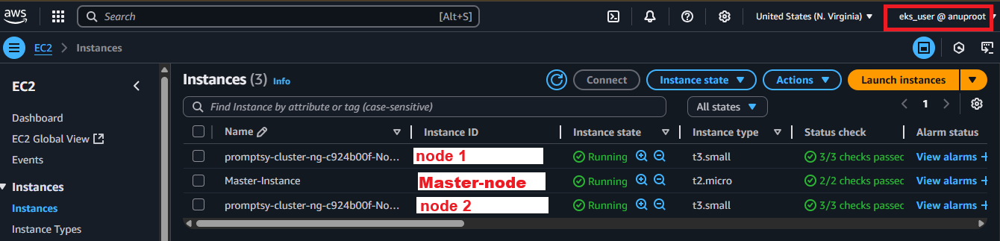

<div align="center">

# PromptsBook 3-Tier Web App Deployed on AWS EKS (auto scale)

### Technologies Used


<br>
</div>

<br>

 Architected and deployed a fault-tolerant, **auto-scalable** full-stack web application on **AWS EKS**, using **Kubernetes** with **2 t3.small nodes** and auto-scaling up to **3 nodes**, achieving **~99.5% uptime** and **reducing downtime by over 60%** through automated scaling and self-healing capabilities. Configured Horizontal Pod Autoscaler, Cluster Autoscaler, and AWS Application Load Balancer to ensure seamless traffic handling for **1,000+ concurrent users, scalable up to 10,000+ sessions.**
<br>

## 📦 Tech Stack

- **Frontend**: Next.js + Tailwind CSS
- **Backend**: Node.js + Express.js
- **Database**: MongoDB
- **Containerization**: Docker, Docker Hub
- **Orchestration**: Kubernetes on AWS EKS
- **Provisioning**: Terraform
- **Tools**: AWS CLI, kubectl

## 🗺️ Architecture Overview
<div align="center">

</div>

## 🛠️ Setup and Deployment Steps

### ✅ Step 1: Install Docker and Build Full Stack Web Application

#### Build 3 Images

```
docker build -t anuplohar001/img_name:latest .
```

1. Image 1 - Frontend (Next.js)
2. Image 2 - Backend (Node.js)
3. Image 3 - Mongodb (Database)

#### Push Images to DockerHub [(anuplohar001)](https://hub.docker.com/repositories/anuplohar001)

```
docker push anuplohar001/img_name:latest 
```

### ✅ Step 2: Install AWS-CLI and Terraform on local machine (windows)

```
cmsiexec.exe /i https://awscli.amazonaws.com/AWSCLIV2.msi
```

### ✅ Step 3: Configure AWS and create Master EC2 instance through Terraform

#### Define ec2 instance with key pair and security group for enabling require PORTS in [main.tf](./terraform/main.tf)

```
aws configure
terraform init
terraform apply
```


### ✅ Step 4: Install aws-cli, kubectl, eksctl and docker.io on Master instance (ec2)

#### AWS-CLI

```
curl "https://awscli.amazonaws.com/awscli-exe-linux-x86_64.zip" -o "awscliv2.zip"
unzip awscliv2.zip
sudo ./aws/install
```

#### Kubectl

```
curl -LO "https://dl.k8s.io/release/$(curl -L -s https://dl.k8s.io/release/stable.txt)/bin/linux/amd64/kubectl"
```

#### Eksctl

```
# for ARM systems, set ARCH to: `arm64`, `armv6` or `armv7`
ARCH=amd64
PLATFORM=$(uname -s)_$ARCH

curl -sLO "https://github.com/eksctl-io/eksctl/releases/latest/download/eksctl_$PLATFORM.tar.gz"

# (Optional) Verify checksum
curl -sL "https://github.com/eksctl-io/eksctl/releases/latest/download/eksctl_checksums.txt" | grep $PLATFORM | sha256sum --check

tar -xzf eksctl_$PLATFORM.tar.gz -C /tmp && rm eksctl_$PLATFORM.tar.gz

sudo install -m 0755 /tmp/eksctl /usr/local/bin && rm /tmp/eksctl
```

### ✅ Step 5: Create EKS clusters through following command

```
eksctl create cluster --name promptsy --region us-east-1 --node-type t2.medium --nodes-min 2 --nodes-max 2 aws eks update-kubeconfig --region us-east-1 --name promptsy kubectl get nodes 
```


#### Min 2 nodes and Max 3 nodes (autoscalable)




### ✅ Step 6: Apply Manifests files

###### 1. For mongodb deployment and service

1. [mongo-pv.yml](./Kubernetes/mongo-pv.yml)
2. [mongo-pvc.yml](./Kubernetes/mongo-pvc.yml)
3. [mongo-dep.yml](./Kubernetes/mongo-dep.yml)
4. [mongo-svc.yml](./Kubernetes/mongo-svc.yml)

###### 2. For Backend (Node.js) deployment and service

1. [backend-dep.yml](./Kubernetes/backend-dep.yml)
2. [backend-svc.yml](./Kubernetes/backend-svc.yml)

###### 3. For Frontend (React.js) deployment and service

1. [frontend-pod.yml](./Kubernetes/frontend-pod.yml)
2. [frontend-svc.yml](./Kubernetes/frontend-svc.yml)

### Finally Deployed on AWS

#### Run cmd

```
kubectl get service
```


